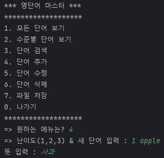
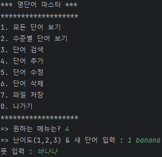
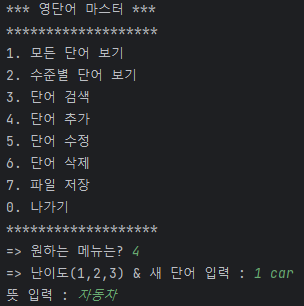
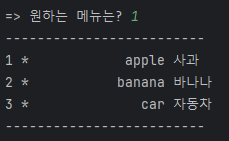

# 1st Project 
> 주제 : Java CRUD application 
> 기간 : 2023.08.28 ~ 
## Intro
> 영단어 사전 CRUD 프로그램 
> * C (craete) : 사용자가 영단어를 추가할 수 있다.
> * R (read) : 등록되어진 모든 영단어를 출력할 수 있다.
> * U (update) : 사용자가 등록되어진 영단어를 수정 할 수 있다.
> * D (delete) : 사용자가 등록되어진 영단어를 삭제 할 수 있다.  
> ## Create  
> </img>
> </img>
> </img>  
> ## Read  
> </img>
