# 1st Project 
> 주제 : Java CRUD application 
> 기간 : 2023.08.28 ~ 
## Intro
> 영단어 사전 CRUD 프로그램 
> * C (craete) : 사용자가 영단어를 추가할 수 있다.
> * R (read) : 등록되어진 모든 영단어를 출력할 수 있다.
> * U (update) : 사용자가 등록되어진 영단어를 수정 할 수 있다.
> * D (delete) : 사용자가 등록되어진 영단어를 삭제 할 수 있다.   
> ## Create  
> </img>
> </img>
> </img>  
> ## Read  
> * 모든 단어 보기  </img>
> * 수준별 단어 보기   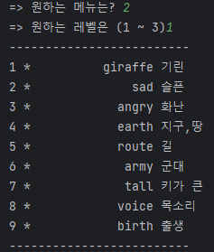</img> 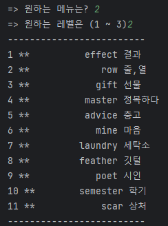</img> 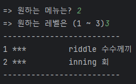</img>
> ## Udate  
> 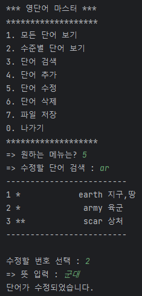</img>
> 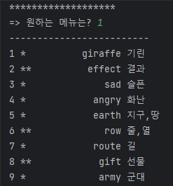</img>  
> 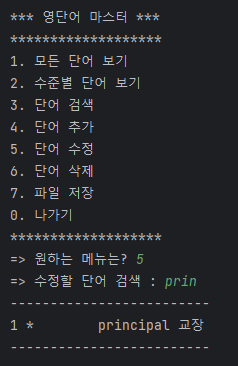</img>
> 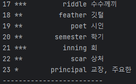</img>
> ## Delete  
> * Before   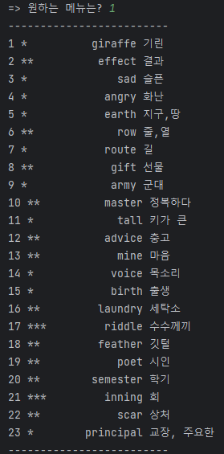</img>
> * Delete : principle 삭제   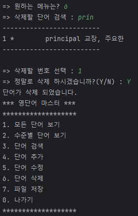</img>
> * After   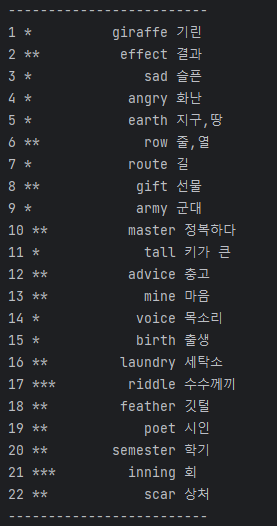</img>

 

### 추가 기능
> * 단어 검색 : 입력한 단어가 포함된 모든 단어를 출력한다.
> * 파일 저장 : 프로그램을 통해 변경된 데이터를 반영하여 데이터 파일에 새로 저장하는 기능이다.
> * 파일 읽기 : 프로그램 시작 시 데이터 파일로 부터 단어 목록을 읽어 오는 기능이다.
>
>  
>
>
>
> ### 단어 검색
> </img> </img> </img>  
> ##
>  
> 
> ### 파일 저장
> 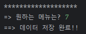</img>  
> #### Dictionary.txt에 저장된 모습
> 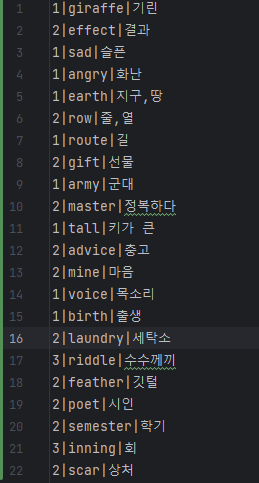</img>
> ##
>  
>
> ### 파일 읽기
> </img>
> #### Dictionary.txt에 저장했던 22개의 단어를 불러온 모습
> 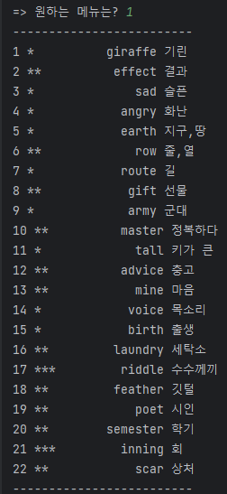</img>

